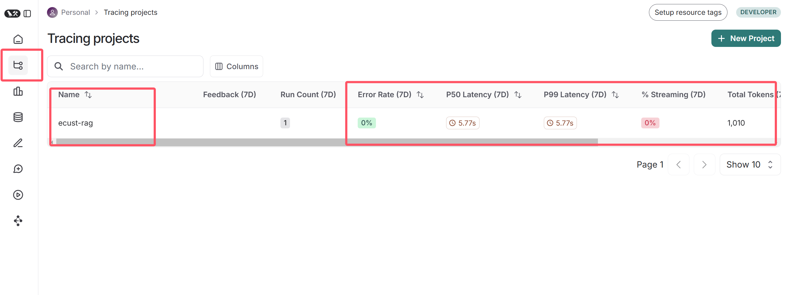
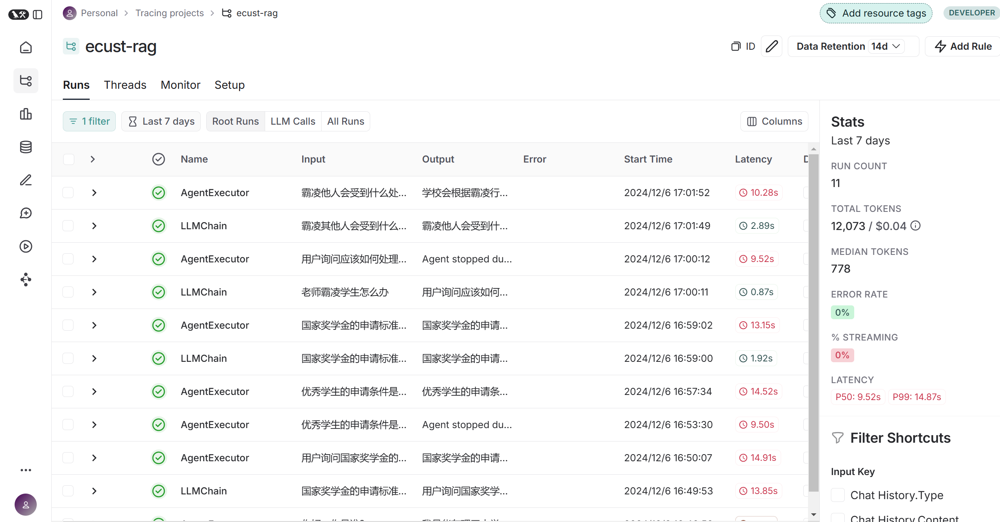

# [LangSmith](https://smith.langchain.com/) 监控大模型服务

## 平台概述
LangSmith 是由 LangChain 公司推出的统一开发平台，旨在简化大语言模型（LLM）应用程序的开发和部署流程。它为开发团队提供了完整的工具链，使 LLM 应用的构建过程更加高效和标准化。

## 五大核心功能

### 1. 调试能力
- 可视化查看事件链中的每个步骤
- 检查模型输入输出结果
- 追踪延迟和 Token 使用情况
- 快速定位问题根源

### 2. 测试框架
- 支持数据样本跟踪
- 允许上传自定义数据集
- 提供手动检查功能
- 支持自动化测试流程

### 3. 评估系统
- 集成开源评估模块
- 支持规则评估
- 提供 LLM 自评估能力
- 优化评估成本

### 4. 监控功能
- 跟踪性能指标
- 监控模型链性能
- 分析用户交互体验
- 支持持续优化

### 5. 平台统一性
- 整合多种开发工具
- 提供统一操作界面
- 简化工作流程
- 降低开发门槛

## 使用

```env
# .env
LANGCHAIN_TRACING_V2=true
LANGCHAIN_ENDPOINT="https://api.smith.langchain.com"
LANGCHAIN_API_KEY="<api-key>"
LANGCHAIN_PROJECT="<project-name>"
```

之后直接进官网监控即可。





可见耗时最长的就是agent部分，每个工具的耗时都是可以接受的，因此项目的主要优化点就在于agent的相应。

langsmith.hub有不同的agent提示词，这里我们更改一下自己写的agent提示词，增加健壮性，适应不同情况:

```python
# agent.py

def query(self, query):
    # ...
    prompt = hub.pull('hwchase17/react-chat')
    prompt.template = '请用中文回答问题！Final Answer 必须尊重 Obversion 的结果，不能改变语义。\n\n' + prompt.template  # 拼一段中文
    llm_agent = create_react_agent(llm=get_llm_model(), tools=tools, prompt=prompt)
    memory = ConversationBufferMemory(memory_key='chat_history')
    agent_executor = AgentExecutor.from_agent_and_tools(
        agent=llm_agent,
        tools=tools,
        memory=memory,
        handle_parsing_errors=True,
        verbose=os.getenv('VERBOSE'),
        max_iterations=3,
    )
    return agent_executor.invoke({"input": query})['output']
```