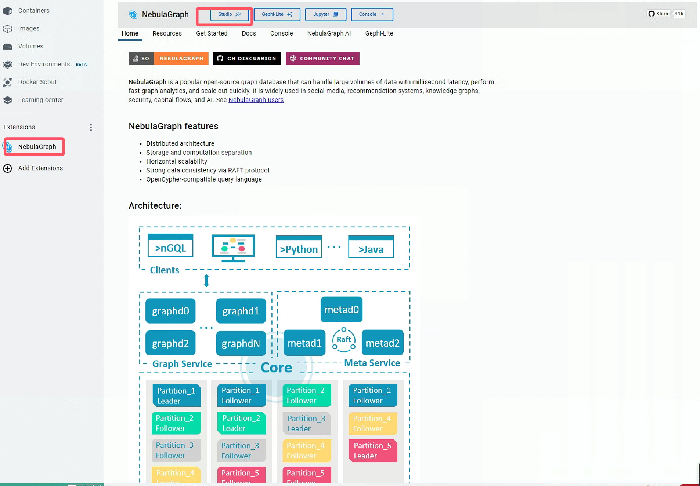

# 使用vllm部署本地模型，借助nebula-graph进行知识图谱构建

1. nebula-graph 安装：直接在docker中搜索`NebulaGraph`插件，下载安装即可，版本：3.8.0

如下图所示：

2. 本地模型采用[glm-4](https://huggingface.co/THUDM/glm-4-9b-chat/tree/main)以及[text2vec-large-chinese](https://huggingface.co/GanymedeNil/text2vec-large-chinese/tree/main)

3. python==3.10